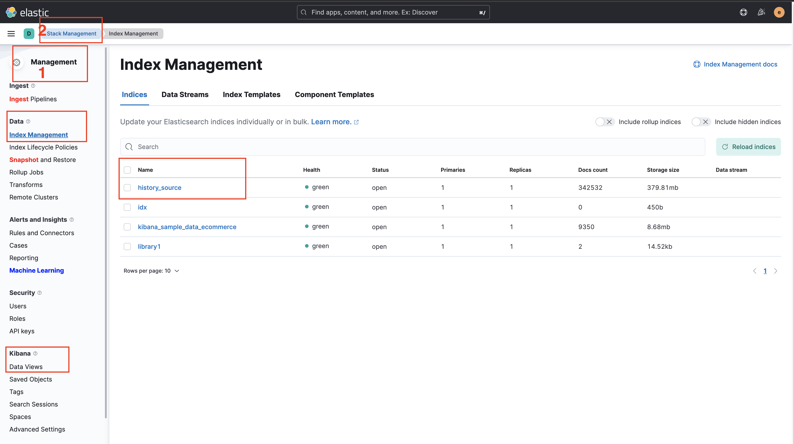
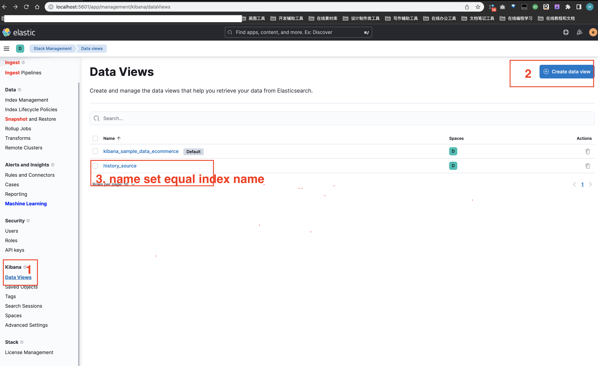
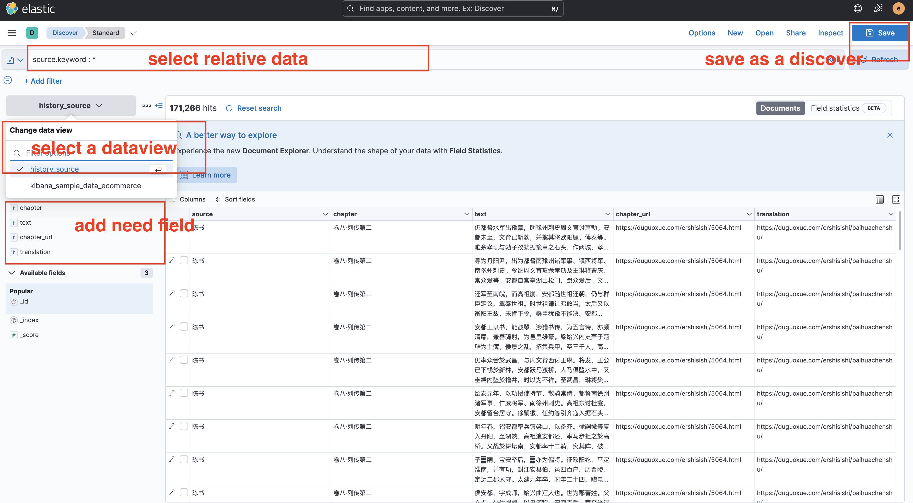
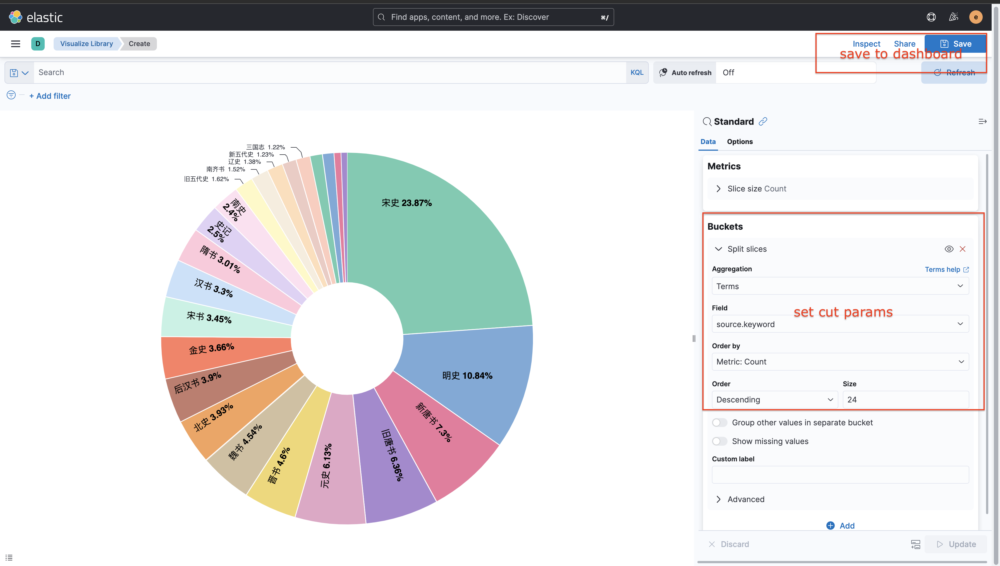
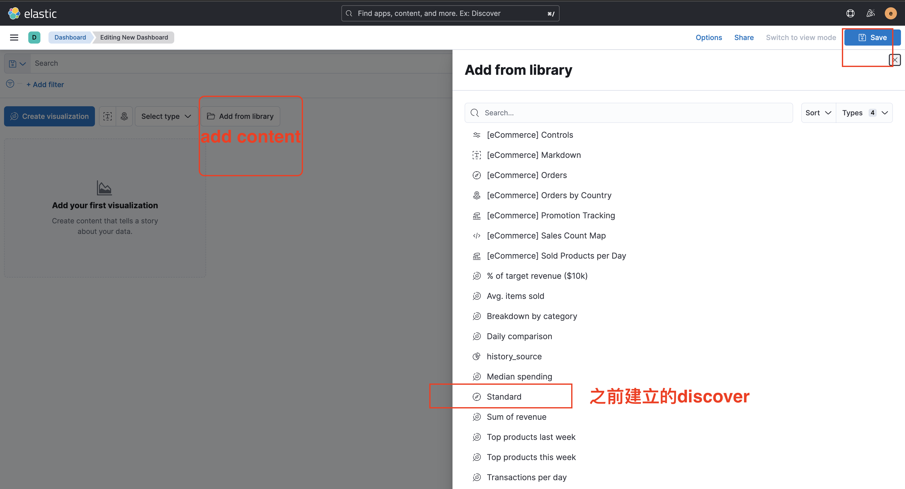
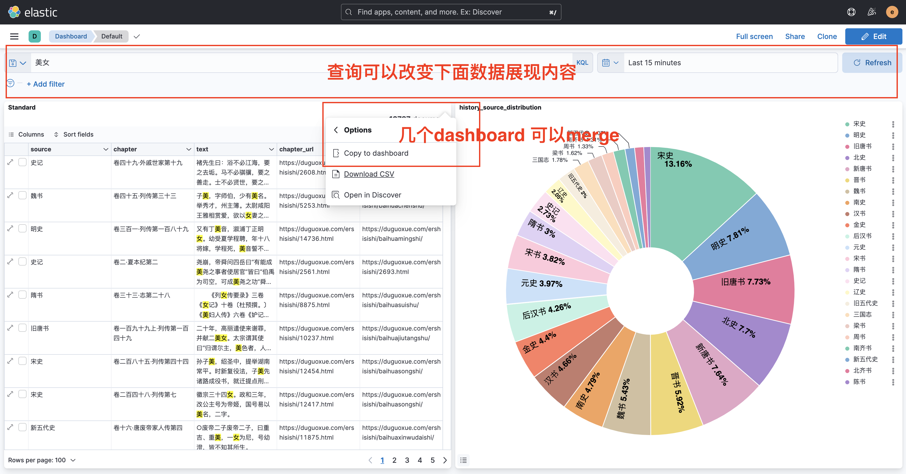

# HistoricalLibrary
基于Elk的 24史索引系统

## 主要功能
- 检索式阅读
- 可视化分析

每一过专求一事。不待数过，而事事精窍矣。

每遍阅读史记只专注一个目的，只需数遍，则事事通透。 也道博观而约取，厚积而薄发。

## 安装Elk
终端下执行:
```shell
cd HistoricalLibrary
docker-compose up -d
```
Make sure that Docker is allotted at least 4GB of memory.

- 确认Elk 安装成功 http://localhost:5601/
- 访问kibana 和 elastic 用户名: elastic, 密码: ELASTIC_PASSWORD (view in .env, change for yourself)
- Elasticsearch 8.2.0, Kibana 8.2.0, Docker 3.3.3, macOs 12.3.1

## 导入数据
终端下执行:
```shell
# python3.8
pip install -r requirements.txt
python historical_library.py
```
 Beware that too large bulk requests might put the cluster under memory pressure 
 when many of them are sent concurrently, 
 so it is advisable to avoid going beyond a couple tens of megabytes per request 
 even if larger requests seem to perform better.

## 卸载
终端下执行:
```shell
docker-compose down
```

## Kibana 使用(8.2.0)

[访问地址](http://localhost:5601/)

- 查看elastic 的所有索引数据



- 给对应的索引建立Data View



- 建立一个discover
  - discover 存储位置[Management - Kibana - Save objects]



- 数据准备完成，使用Visualize分析[Analytic - Visualize Library- create visualization - Aggregation based - Pie - 选择一个数据源（之前创建的discover和data view 都可以)]
- 创建一个饼图



- 创建一个dashboard



- 数据合并展示



- 修改 Kibana - environment - kibana.defaultAppId 可以改变之后登录kibana默认打开页面,需要重启容器

```yaml
kibana.defaultAppId: dashboard/7847c610-3b0f-11eb-bd6d-934d57bf2bb6 # from databoard url
```

- Kibana 控制台[Management - Dev Tools]

[控制台](http://localhost:5601/app/dev_tools#/console)

## Reference

- [kibana功能列表](https://www.elastic.co/cn/kibana/features)

- [elk docker-compose 参考](https://www.elastic.co/guide/en/elasticsearch/reference/current/docker.html#docker-file)
- [elasticsearch 访问限制文档](https://www.elastic.co/guide/en/elasticsearch/reference/current/tune-for-indexing-speed.html#multiple-workers-threads)
- https://github.com/Astringentfruit/ChineseHistoricalSource
- https://duguoxue.com/ershisishi/

